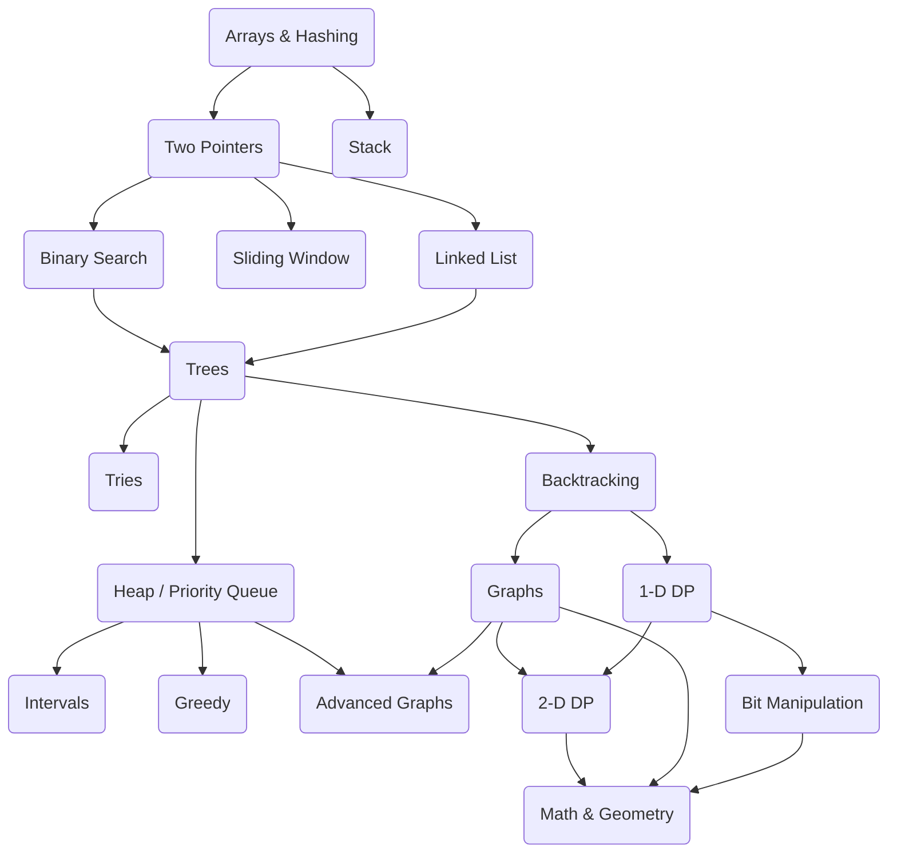

# LeetCode-Algorithms

A collection of my solutions to LeetCode algorithm questions, organized by problem category. Includes detailed explanations and optimized code implementations to help with algorithm practice and learning.

## Roadmap

https://neetcode.io/roadmap

